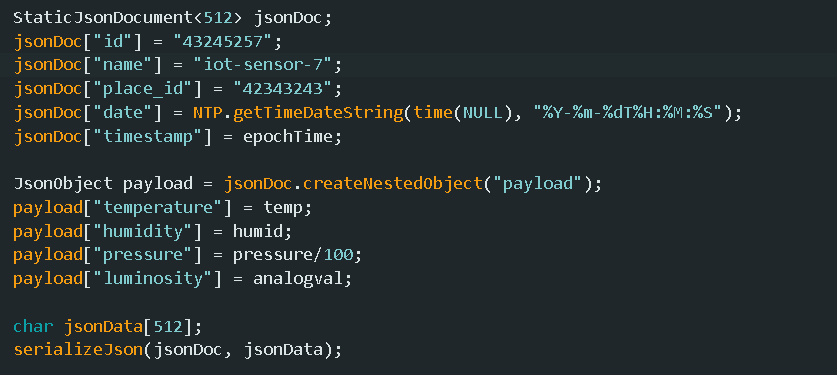

# Ingest and store real-time data from IoT sensors.
>> ในการเก็บและจัดการข้อมูลแบบเรียลไทม์จากเซ็นเซอร์ IoT เราได้ใช้ซอฟต์แวร์และเครื่องมือดังนี้:

MQTT Broker:

    Mosquitto: เป็น MQTT Broker ใช้ในการรับส่งข้อมูลระหว่าง Sensor และ Application

    Eclipse Mosquitto: เป็นตัวเลือกยอดนิยมสำหรับการทำงานกับ MQTT Broker

Microservices Framework:

    Spring Boot: ใช้ในการพัฒนาแอปพลิเคชัน Microservices ที่สามารถจัดการข้อมูลที่ได้รับจาก MQTT Broker และดำเนินการต่อ

Database:

    MongoDB: ใช้สำหรับเก็บข้อมูลที่รับมาจาก MQTT Broker เนื่องจากเป็นฐานข้อมูล NoSQL ที่เหมาะกับข้อมูลที่มีรูปแบบไม่แน่นอน

Data Visualization and Monitoring:

    Grafana: ใช้สำหรับการสร้าง Dashboard เพื่อแสดงข้อมูลที่เก็บไว้ในฐานข้อมูล เช่น MongoDB หรือ Prometheus

Data Processing:

    Apache Kafka: ใช้สำหรับจัดการการ streaming ข้อมูลที่มีปริมาณสูง โดยสามารถรวมข้อมูลจากหลายแหล่งและส่งข้อมูลไปยังการประมวลผลเพิ่มเติม

## MQTT Topic and Payload
>> MQTT Topic:

    Topic ที่เราใช้จะเป็น iot-frames ซึ่งจะรับค่าเป็น iot-sensor ตั้งแต่ 1-10 ซึ่ง 1 และ 2 จะรับค่าจาก server และ computer ส่วนตั้งแต่ 3-10 จะรับค่าจาก อุปกรณ์ IOT ที่ส่งมาจากที่อื่นๆ

    MQTT Payload:   โค้ดด้านล่างเป็นโค้ดที่ใช้สำหรับสร้าง Payload เพื่อส่งไปยัง server กับ grafana และแสดงผลการทำงานของข้อมูลบน Arduino

## ESP32

>> ด้านล่างนี้คือโค้ดที่ใช้ Upload ไปยัง Cucumber ESP32

#include <Wire.h>
#include <Adafruit_BMP280.h>
#include <Adafruit_MPU6050.h>
#include <SensirionI2cSht4x.h>
#include <Adafruit_NeoPixel.h>
#include <ESPNtpClient.h>
#include <PubSubClient.h>
#include <ArduinoJson.h>
#include <WiFiUdp.h>
#include <WiFi.h>
#include <SPI.h>

// WiFi credentials
const char* ssid = "TP-Link_7CC6";
const char* password = "08378774";
const char* mqtt_server = "172.16.47.1";
const int mqtt_port = 1883;

// NeoPixel settings
#define LED_PIN    18
#define LED_COUNT  1
#define RGB_BRIGHTNESS 50
Adafruit_NeoPixel strip(LED_COUNT, LED_PIN, NEO_GRB + NEO_KHZ800);

// MQTT credentials
const char* mqtt_user = "iot-frames-3";
const char* mqtt_password = "1234";

// NTP Server
const PROGMEM char* ntpServer = "158.108.212.149";

// Sensor Config
Adafruit_BMP280 bmp280;
SensirionI2cSht4x sensor;
int sensorPin = 5;

// Error handling
static char errorMessage[64];
static int16_t error;
#define NO_ERROR 0

// Network config
WiFiClient espClient;
PubSubClient client(espClient);
WiFiServer server(1883);
IPAddress local_IP(172, 16, 47, 72);
IPAddress gateway(172, 16, 46, 254);
IPAddress subnet(255, 255, 255, 0);

void blinkLED(uint32_t color, int delayTime) {
  strip.setPixelColor(0, color);
  strip.show();
  delay(delayTime);
  strip.setPixelColor(0, strip.Color(0, 0, 0));
  strip.show();
  delay(delayTime);
}

bool setup_wifi() {
  if (WiFi.status() != WL_CONNECTED) {
    Serial.println("Connecting to WiFi...");
    WiFi.begin(ssid, password);
    int attempts = 0;
    while (WiFi.status() != WL_CONNECTED && attempts < 10) {
      blinkLED(strip.Color(255, 0, 0), 1000); // Blink red
      Serial.print(".");
      attempts++;
    }
    if (WiFi.status() != WL_CONNECTED) {
      Serial.println("\nFailed to connect to WiFi. Restarting setup...");
      return false;
    }
  }
  Serial.println("\nConnected to WiFi");
  return true;
}

bool mqtt_handle() {
  if (!client.connected()) {
    Serial.print("Connecting to MQTT...");
    client.setServer(mqtt_server, mqtt_port);
    int attempts = 0;
    while (!client.connected() && attempts < 5) {
      blinkLED(strip.Color(255, 255, 255), 1000); // Blink blue
      if (client.connect("ESP32Client20", mqtt_user, mqtt_password)) {
        Serial.println("Connected to MQTT");
        client.subscribe("esp32/sensorData");
        return true;
      }
      Serial.print(".");
      attempts++;
    }
    Serial.println("\nFailed to connect to MQTT. Restarting setup...");
    return false;
  }
  return true;
}

void init_BMP280() {
  if (!bmp280.begin(0x76)) {
    Serial.println(F("BMP280 Down"));
    while (1) delay(10);
  }

  bmp280.setSampling(Adafruit_BMP280::MODE_NORMAL,
                     Adafruit_BMP280::SAMPLING_X2,
                     Adafruit_BMP280::SAMPLING_X16,
                     Adafruit_BMP280::FILTER_X16,
                     Adafruit_BMP280::STANDBY_MS_500);
  Serial.println("BMP280 ready");
}

void init_SHT4x() {
  sensor.begin(Wire, SHT40_I2C_ADDR_44);
  sensor.softReset();
  delay(10);
  uint32_t serialNumber = 0;
  error = sensor.serialNumber(serialNumber);
  checkError(error, "Error to call serialNumber()");
  Serial.print("serialNumber: ");
  Serial.println(serialNumber);
}

void checkError(int16_t error, const char* errorMsg) {
  if (error != NO_ERROR) {
    Serial.print(errorMsg);
    errorToString(error, errorMessage, sizeof errorMessage);
    Serial.println(errorMessage);
  }
}

void init_NTP() {
  NTP.setTimeZone(TZ_Asia_Bangkok);
  NTP.setInterval(600);
  NTP.setNTPTimeout(5000);
  NTP.begin(ntpServer);
}

unsigned long Get_EpochTime() {
    time_t now;
    struct tm timeinfo;
    if (!getLocalTime(&timeinfo)) {
      return 0;
    }
    time(&now);
    return now;
}

bool sendData() {
  float temp = bmp280.readTemperature();
  float pressure = bmp280.readPressure();
  float humid = 0.0;
  error = sensor.measureLowestPrecision(temp, humid);
  checkError(error, "Error calling STHX4");
  int analogval = analogRead(sensorPin);
  unsigned long epochTime = Get_EpochTime();

  StaticJsonDocument<512> jsonDoc;
  jsonDoc["id"] = "43245257";
  jsonDoc["name"] = "iot-sensor-7";
  jsonDoc["place_id"] = "42343243";
  jsonDoc["date"] = NTP.getTimeDateString(time(NULL), "%Y-%m-%dT%H:%M:%S");
  jsonDoc["timestamp"] = epochTime;

  JsonObject payload = jsonDoc.createNestedObject("payload");
  payload["temperature"] = temp;
  payload["humidity"] = humid;
  payload["pressure"] = pressure/100;
  payload["luminosity"] = analogval;

  char jsonData[512];
  serializeJson(jsonDoc, jsonData);

  if (client.publish("iot-frames", jsonData)) {
    Serial.println("Data sent successfully");
    blinkLED(strip.Color(0, 0, 255), 1000); // Blink green
    return true;
  } else {
    Serial.println("Failed to send data. Restarting setup...");
    return false;
  }
}

void setup() {
  Wire.begin(41, 40);
  Serial.begin(115200);

  strip.begin();
  strip.setBrightness(RGB_BRIGHTNESS);
  strip.show();

  init_BMP280();
  init_SHT4x();
  init_NTP();

  if (!WiFi.config(local_IP, gateway, subnet)) {
    Serial.println("WiFi Failed to configure");
  }

  server.begin();
}

void loop() {
  if (!setup_wifi()) {
    return;
  }

  if (!mqtt_handle()) {
    return;
  }

  if (!sendData()) {
    return;
  }

  delay(5000); // Wait for 5 seconds before the next loop
}

ต่อไปนี้จะเป็นลำดับการทำงานและ Flowchart ของ การทำงานในโค้ด

----------------------------
Start:
Initialization:

Initialize การสื่อสารผ่าน Serial
Initialize การทำงานของ NeoPixel LED Strip
Initialize การทำงานของเซ็นเซอร์ BMP280
Initialize การทำงานของเซ็นเซอร์ SHT4x
Setup NTP (Network Time Protocol)
Setup WiFi
Initialize Server
----------------------------

----------------------------
Main loop:
ตรวจสอบการเชื่อมต่อ WiFi:

หากเชื่อมต่อได้ ให้ดำเนินการต่อ
หากไม่สามารถเชื่อมต่อได้ ให้กระพริบ LED สีแดงและลองเชื่อมต่ออีกครั้งจนกว่าจะเชื่อมต่อได้ หรือหยุดการทำงาน
----------------------------

----------------------------
ตรวจสอบการเชื่อมต่อ MQTT:

หากเชื่อมต่อได้ ให้ดำเนินการต่อ
หากไม่สามารถเชื่อมต่อได้ ให้กระพริบ LED สีฟ้าและลองเชื่อมต่ออีกครั้งจนกว่าจะเชื่อมต่อได้ หรือหยุดการทำงาน
----------------------------

----------------------------
ส่งข้อมูล:

อ่านข้อมูลจากเซ็นเซอร์ BMP280 และ SHT4x
สร้างเอกสาร JSON ด้วยข้อมูลเซ็นเซอร์
ส่งข้อมูล JSON ไปยังหัวข้อ MQTT
หากส่งข้อมูลสำเร็จ ให้กระพริบ LED สีเขียว
หากส่งข้อมูลล้มเหลว ให้เริ่มต้นการตั้งค่าใหม่
----------------------------

----------------------------
รอ 5 วินาที
----------------------------

----------------------------
ทำซ้ำลูป
----------------------------

รูป Flowchart

